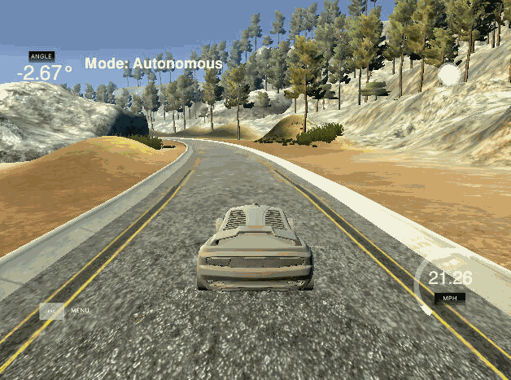

# PID-Project
Udacity - Self-Driving Car Engineer Nanodegree Program

---

## Dependencies

* cmake >= 3.5
 * All OSes: [click here for installation instructions](https://cmake.org/install/)
* make >= 4.1(mac, linux), 3.81(Windows)
  * Linux: make is installed by default on most Linux distros
  * Mac: [install Xcode command line tools to get make](https://developer.apple.com/xcode/features/)
  * Windows: [Click here for installation instructions](http://gnuwin32.sourceforge.net/packages/make.htm)
* gcc/g++ >= 5.4
  * Linux: gcc / g++ is installed by default on most Linux distros
  * Mac: same deal as make - [install Xcode command line tools]((https://developer.apple.com/xcode/features/)
  * Windows: recommend using [MinGW](http://www.mingw.org/)
* [uWebSockets](https://github.com/uWebSockets/uWebSockets)
  * Run either `./install-mac.sh` or `./install-ubuntu.sh`.
  * If you install from source, checkout to commit `e94b6e1`, i.e.
    ```
    git clone https://github.com/uWebSockets/uWebSockets 
    cd uWebSockets
    git checkout e94b6e1
    ```
    Some function signatures have changed in v0.14.x. See [this PR](https://github.com/udacity/CarND-MPC-Project/pull/3) for more details.
* Simulator. You can download these from the [project intro page](https://github.com/udacity/self-driving-car-sim/releases) in the classroom.


## How to build (Linux)

1. Clone this repository
2. Navigate into the "CarND-PID-Control-Project"-folder
3. Run `./install-ubuntu.sh`
4. Navigate into the "build" folder
5. Run `cmake ..`
6. Run `make`

Additional tips/tricks from udacity for setting up your environment can be found [here](https://classroom.udacity.com/nanodegrees/nd013/parts/40f38239-66b6-46ec-ae68-03afd8a601c8/modules/0949fca6-b379-42af-a919-ee50aa304e6a/lessons/f758c44c-5e40-4e01-93b5-1a82aa4e044f/concepts/23d376c7-0195-4276-bdf0-e02f1f3c665d)

## Code Style

The code style is inspired by [Google's C++ style guide](https://google.github.io/styleguide/cppguide.html).

## Project description/goal
The goal of the project is to implemented a so called PID controller.
The acronym "PID" stands for "Proportional-Integral-Derivative" and uses, as the name says the three parts "Proportional", "Integral" and "Derivative" to minimize the so called Cross-Track Error (CTE). The cross-track error is the delta between the current position vs optimal position (given by the specific coefficients in my case). In the following chapter i will describe exactly why PID is an impressive good approach to archive the cross-track error minimization.

Proportional: The propotional part of the PID-controller uses the cross-track-error value itself to steer back to the best position. Therefore the cross-track-error is multiplied by the negated p-coefficient to ensure the vehicle steers in the opposite direction of the current error so it gets back to the optimal path.
By selecting a low coefficient the vehicle will need a lot of time to get back to the optimal path on the other hand a to big chosen coefficient causes the car to oscillate a lot around the optimal-position because it steers hard until the optimal path is reached and even drives beyond the optimum line (cte 0) so it has to counter-steer over and over again. The lower the selected coefficient the less the car will oscilliate.

Integral: The integral of the PID-controller uses the sum of all previously occured cross-track-error-values multiplied with a (mostly) small coefficient. Due to the fact that the
steering-angle of a car may not be mounted/adjusted 100% accurate, the integral-part of the PID-controller ensures that a continuous/static cross-track-error is compensated.
When the sum of the cte does not increase/decrease anymore, the error is fully compensated. In my case i've used a integral value of 0.0 in the simulator because the simulated car 
seems to no have any deviation in the steering angle.

Derivation: The derivation uses the delta between the previous cross-track-error and the current cross-track-error (normally even respective to the time). As described in the "proportional"-part the car would oscillate only using the proportional-part and the derivate-part is used to counteract the oscillating movement. By using the derivation (delta: previous-cte - current-cte) the steering of the car is reduced as the car comes closer to the optimal-path (0.0 cte) which leads to a smooth curvatur. Moreover if the car drives a curve the derivation has no negative impact to the car because in this case the cross-track-error value increase which leads the car to steer harder to get back to the optimal path.

Here is a nice figure which describes the combination of P, I and D quite well. Provided by Udacity


Using a combination of all the parts of the PID controller leads to a very good driving behavior by reducing the cross-track-error and avoid unappealing driving behaviour (e.g. oscillating).

The challenge was to implement the PID-controller itself and find the needed coefficients. The formula to calculate the total-error using the coefficients (in this case starting with a "K" and the error-variable for p, i and d is shown here:
```
double PID::TotalError() {
  //     |------P------|   |------I-----|   |------D-----|    
  return (p_error * -Kp) - (i_error * Ki) - (d_error * Kd);
}
```
The result of the TotalError-function-call is then returned to the simulator to control the steering of the car

Everytime the simulator returned a new cross-track-error the variables of the PID-controller were updated.
As you can see in the code below, i've calulcated the derivative-error (d_error) before updating the proportional_error (p_error) so i don't have buffer the value in a separate variable.
This will reduce memory-consumption and increases the application performance.
```
void PID::UpdateError(double cte) {
  // D of PID is the error-derivation (the delta of the previous to the current error taking into account the elapsed time)
  d_error = cte - p_error;
  
  // Proportional of PID is the cross-track error itself
  p_error = cte;
  
  // Intergral of PID is the sum of all cte-values, this will help with systematic-bias-problem 
  // which e.g. occures when the wheels are not perfectly aligned
  i_error += cte;
}
```

How i've found the coefficients and additional methods to do so, are described in the next chapter.

## Find the coefficients

There are different ways to find the coefficients. I will describe the option i've choosed (quite simple) and the advanced method which could also be implemented. My approach is a more try'n'error-approach, the other is a bit more compilacted and contains a algorithm and delivers better results.

Manual approach:
I've decided to go for the manual approach which leads to good results in my case. 
First of all i've implemented the functionality to pass the coefficients at the program start like this: 
```sh
# Program P-Param I-Param D-Param
./pid 0.0 0.0 0.0
```

This allows me to easily play with different coefficient without having to recompile the whole source-code for attempts with different values.

The program then convert the arguments (which are strings) into floats/doubles and initialize the variables for the PID-controller.
Here is the part of the code where this happens:
```cpp
// Variable declaration
double kp, kd, ki;
if (argc == 4) {
  // Use parameters passed from outside
  kp = atof(argv[1]);
  ki = atof(argv[2]);
  kd = atof(argv[3]);
} else {
  // Default use the manual evaluate values which work for the simulator
  kp = 0.12;
  ki = 0.0;
  kd = 1.5;
}
```
Note: The "argc == 4" has not to be 3, because:
-  1 (index 0) is the program-name
- 2 (index 1) = kp (Proportional coefficient)
- 3 (index 2) = ki (Integral coefficient)
- 4 (index 3) = kd (Derivation coefficient)


If no params are passed i've filled in the values which i've found out to work for the simulator. Just call the program like that:
```sh
./pid
```
In thise case the following values are used (as you can see in the code snippet above)
- kp = 0.12
- ki = 0.0
- kd = 1.5.

To find that values i've first of all set the ki (integral-coefficient) and kd (derivation-coefficient) value to 0.0 and just played around with the kp-value (proportional coefficient).
I've started with a value of 1.0 and realised this value lets the car ocsillating pretty hard and even drived outside of the lane after just a few meters.


An example of the PID-controller using 
- P 1.0 
- I 0.0 
- D 0.0



After decreasing the value i was able to found out that a value of 0.1 let the car oscillating but also allowed the car to drive on a straight-lane pretty well, just when lane started to curve the car began to steer to much and drove outside the lane. 


An example of the PID-controller using 
- P 0.1 
- I 0.0 
- D 0.0


To compensate the oscillating which increased in the curve i've started to increase the coefficient for the derivation which should reduce the steering as the car gets closer to the middle of the lane (lower cte-value) but also ensures that the car is able to steer enough in curves too. 

The increasing of the kd-value tooks a few attemps because the value needs to fit all different curves of the track but finally i realised that a value between 1.4 and 1.6 works quite good. Because both values had pros and cons at different curves i've decided to took the value in between which is 1.5.


An example of the PID-controller using 
- P 0.1
- I 0.0
- D 1.5


Due to the fact, that the car in the simulator seems not to have an offset in the steering-angle (e.g. steering of 0.0 is not absolutly straight) i've not changed the ki-value which would be a compensator in this case. In the end my evaluated values did a pretty good job in the simulator.

Next to my method (mostly try'n'error) there is an even more algorithmic approach which could be used to find even better coefficients but for sure increases the computation-work a lot. Below you can find a simple description how to implement this algorithm, a detailed description can be found [here](https://martin-thoma.com/twiddle/). The method is called "Twiddle" and works for nearly each problem where a limited amount of coefficients is searched and a single error-value is returned.

The algorithm starts by intializing all coefficients with a value of 0.0, save a weight for each value (weight: 1.0), call the error-calculation function and remind the error-value returned.
In the next step you go through the amount of coeffienct and do the following (step by step)

- 1: Add the specific weight to the coefficient and calculate the total error
  - 1.1. Compare the new error to the previous error:
    - a. Error decreased: save new error, increase weight for the specific coefficient (e.g.: weight *= 1.1 (+10%)), proceed with the next coefficient
    - b. Error increased / not changed: Set the coefficient back to the original value (substract the previously added weight), proceed with 2.
- 2: Substract the specific weight from the coefficient and calculate the total error
  - 2.1: Compare the new error to the previous error:
    - a. Error decreased: save new error, increase weight for the specific coefficient (e.g.: weight *= 1.1 (+10%)), proceed with the next coefficient
    - b. Error increased / not changed: Set the coefficient back to the original value (add the previously substracted weight), proceed with 3.
- 3: Because both attempts 1./2. didn't lead to a better result: decrease the weight (e.g. weight *= 0.9 (-10%)) 
  - 3.1: Proceed with the next coefficient.

The steps above are repeated over and over again, until the sum of the weights for the coefficients fall below a certain threshold (e.g. 0.002). The lower the threshold the more exact the values (coefficients) will be.

Note: As always its a simple trade of: 
> Lower threshold  = More exact = More calculation (time).
> Higher threshold = Less exact = Less calculation (time)